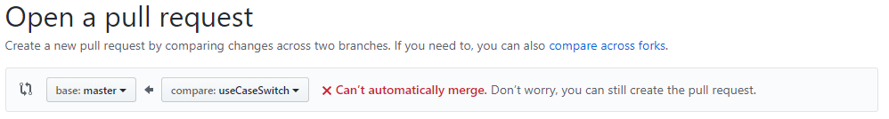
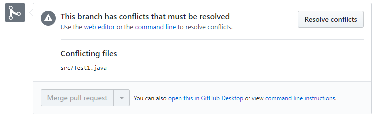
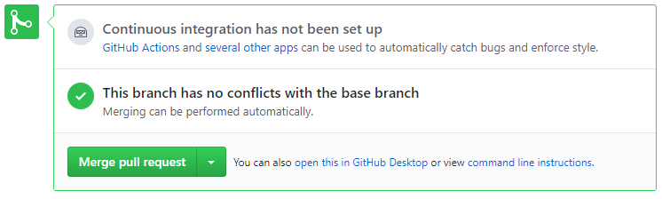

# CS193HW5 Individual Assignment
 
## What is this assignment
In this assignment, you will be adding a feature to a basic calculator function using a feature branch. After you complete your feature, you will learn how to resolve a merge conflict when you try to merge the feature into the master branch. 
 
## When is this due?
This homework will be due on Monday, 11/25
 
## When will I know I'm done?
Advice: read the steps!!
 
You should be finished when the implementation of the calculator function is in your master branch.
 
## Step 1: Clone the repository. TODOs exist here
As you've done before, everything git related usually starts with a clone. Once you have accepted the assignment and downloaded the classroom code, click on the green `clone or download` button on the top right and copy the https link. **run** the command `git clone <your-https-link>`. As you know, all this command does is to download a copy of the *remote* repository to your *local* machine. 
 
Now if you run `ls`, you should see a directory called `homework-5-individual-<your GitHub username>`. `cd` into this directory and run `ls` again and you should see all the same files that GitHub shows in the browser for this repository. 

## Step 2: Create a Feature Branch
The current calculator uses if-elseif-else logic, as seen in test1.java. However, management has decided that this needs to be implemented using switch-cases. Your job now is to change the method's implementation to use a switch statement instead. 

One very important part of good git practices is proper use of branches. In particular, before you make any changes, you should create a new branch off of the base branch (in this case a new branch off of the master branch) and give this new branch a name that describes the change you are going to make. Let's do this now. Make sure you are on the `master` branch and run `git checkout -b useCaseSwitch`. Run `git branch` again to verify that you have created and checked out a new branch called `useCaseSwitch`.

## Step 3: Write the new feature

The method `basicCalculator` takes in an operator and two numbers and returns a result based on that operator. Keep in mind that the operator is an Enum. The values of the enum are: ADD, SUBTRACT, MULTIPLY, DIVIDE. If you are unsure how to do enum comparisons feel free to look on Google. **You must implement this method with a switch-case**.

Once you are satisfied that you have a functioning calculator that uses case-switch statements, add and commit your changes. Make sure you push your changes to GitHub as well! (Remember, since we created a new branch, you will need to run `git push --set-upstream origin useCaseSwitch` to set the upstream branch)

## Step 4: Your Coworker Makes a Scene!
In this part, you'll be playing the part of a pesky coworker who decided to ruin the calculator code with lies! Go to your homework 5 respository on the **browser version github**. Click on test.java and then on the pencil icon to edit the file in the browser. Replace the basicCalculator function with the following code:

```
public static double basicCalculator(Operation operation, int num1, int num2){
        double result = 0;

        if(operation == Operation.ADD) {
            System.out.println("CS193 sucks");
        }
        else if(operation == Operation.SUBTRACT) {
            System.out.println("CS193 is not everyone's favorite class");
        }
        else if(operation == Operation.MULTIPLY) {
            System.out.println("The CS193 lecturers do not want us to thrive in CS");
        }
        else {
            if(num2 == 0) {
                System.out.println("Error: u suck");
            }
            else {
                result = num1 / num2;
            }
        }

        return result;
    }
```
At the bottom of the screen, click the green button that says *Commit changes*

## Step 5: Open a Pull Request

Now that we have pushed our changes to our feature branch, we need to merge these changes into the master branch. In a web browser, navigate to your homework 5 repository. If you did everything correctly up to this point, GitHub should already display the `useCaseSwitch` branch as a recently pushed to branch as shown in the image below: 


What we want to do next is called opening a *Pull Request*. A pull request is essentially a set of proposed changes to the main repository from a fork that can be looked over, reviewed, and commented on by the other contributors to the main repository.

Click the big green button that says `Compare & pull request` to start this process. You will be taken to a page where you can specify the settings of your pull request. Let's walk through what these are. 

The first option, `base` is the branch that we want these changes to go to. In our case, this is the `master` branch.

As seen in the photo below, Github has found a merge conflict after your pesky coworker changed the master branch. This means that Github cannot automatically merge your feature branch into your master branch. Don't worry, though- we'll still create the pull request! We will deal with the merge conflict in the next step. 



Once you have reviewed all the options, click the big green `Create pull request` button.

## Step 6: Fixing the Merge Conflict

As you can probably guess, you'll more often than not be working on a project with more people than just yourself. With multiple people working in the same files, a phenomenon known as a "merge conflict" is bound to happen. A merge conflict is a instance where a change in another branch cannot be merged automatically by git with the changes you are trying to merge.

 

Your new pull request can be found in the pull request tab. After clicking on it, you can view if your branch can be merged or not. Because of the merge conflict, we cannot automatically merge. You can see this is the case since the pull request page shows the following message:



We must fix the merge conflict to merge our feature branch to master. Click on the button that says `Resolve conflicts`.

git tells us the beginning of the merge conflict with a line that looks like this: `<<<<<<< useCaseSwitch` The line immediately following the `useCaseSwitch` line is the version of this line from our feature branch (in this case our `useCaseSwitch` branch). 

git then displays a line like this: `=======` that signifies the change between the version from the `useCaseSwitch` branch and the *base* branch. In this case, the *base* branch is the master branch in our assignment repository. 

Immediately following the line of `=` is the version of the change from the *base* branch, and immediately following this line is a line that looks like: `>>>>>>> master`. 

To fix the merge conflict, you need to remove the version of the change that you do not want, and keep the version that you do want. Right now, we want the version that uses case switch statements to implement the calculator functions properly. You also need to remove the line markers that git added: `<<<<<<< useCaseSwitch`, `=======`, and `>>>>>>> master`. 

Once you have that done, click the button on the top right that says `mark as resolved`. This will get you a green button that says `Commit merge`. Click this to commit this merge and solve your merge conflict!

Now that the conflict is gone, you will be brought back to the pull request screen. Now you should see the following message:



Click `Merge Pull Request`; this will merge your changes to the master branch. To double check your progress, go back to the master branch and check if your case switch statement is in Test1.java. Good job, you've successfully fixed a merge conflict and merged your feature into the master branch! Your coworker has been fired from your calculator company for messing with the master branch directly.


